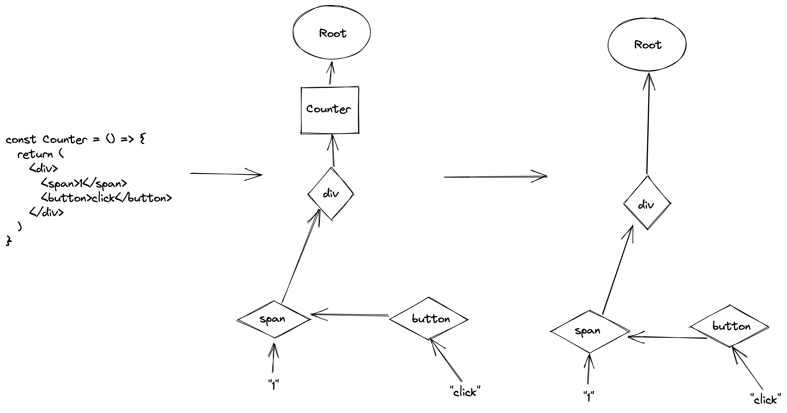

**本文介绍React基本工作原理**

---

我们知道，程序 = 数据结构 + 算法，要理解React的工作原理需要先了解其数据结构，那先来看看React内经常在面试题里出现的数据结构：虚拟DOM。

## 虚拟DOM

<!--TODO: 这里待补充为啥要叫fiber节点-->
虚拟DOM其实是React在内存中维护的一棵与当前页面结构对应的树，这棵树上的节点被称为fiber节点，这棵树被称为current fiber树，之所以叫current，是因为它对应到的是 **_当前_** 页面上的真实DOM结构。下图是一个JSX代码片段、fiber树和DOM树之间的对比。

基本上我们写的每一个jsx标签会对应到fiber树中的一个节点，但不是每一个fiber节点都会对应到一个DOM节点，比如这里的Counter。

## fiber节点

fiber节点的数据结构如下：

```javascript
function FiberNode(
  tag: WorkTag,
  pendingProps: mixed,
  key: null | string,
  mode: TypeOfMode,
) {
  // Instance
  this.tag = tag;
  this.key = key;
  this.elementType = null;
  this.type = null;
  this.stateNode = null;

  // Fiber
  this.return = null;
  this.child = null;
  this.sibling = null;
  this.index = 0;

  this.ref = null;

  this.pendingProps = pendingProps;
  this.memoizedProps = null;
  this.updateQueue = null;
  this.memoizedState = null;
  this.dependencies = null;

  this.mode = mode;

  // Effects
  this.flags = NoFlags;
  this.subtreeFlags = NoFlags;
  this.deletions = null;

  this.lanes = NoLanes;
  this.childLanes = NoLanes;

  this.alternate = null;
}
```


## 双缓存

那么，React是怎么基于这样的一个结构进行视图的更新的呢？

我们可以简单的认为：当我们调用setState等API时，react就会开始调度一次更新，这次更新里有传入setState中的新的state，react基于新的state产生一棵新的fiber树，与current fiber树做比较，根据比较的结果更新DOM结构（节点的*删除*、*新增*和 *更新* 等），即产生了浏览器一帧的图像，而这棵新的fiber树就变成了current fiber树。


